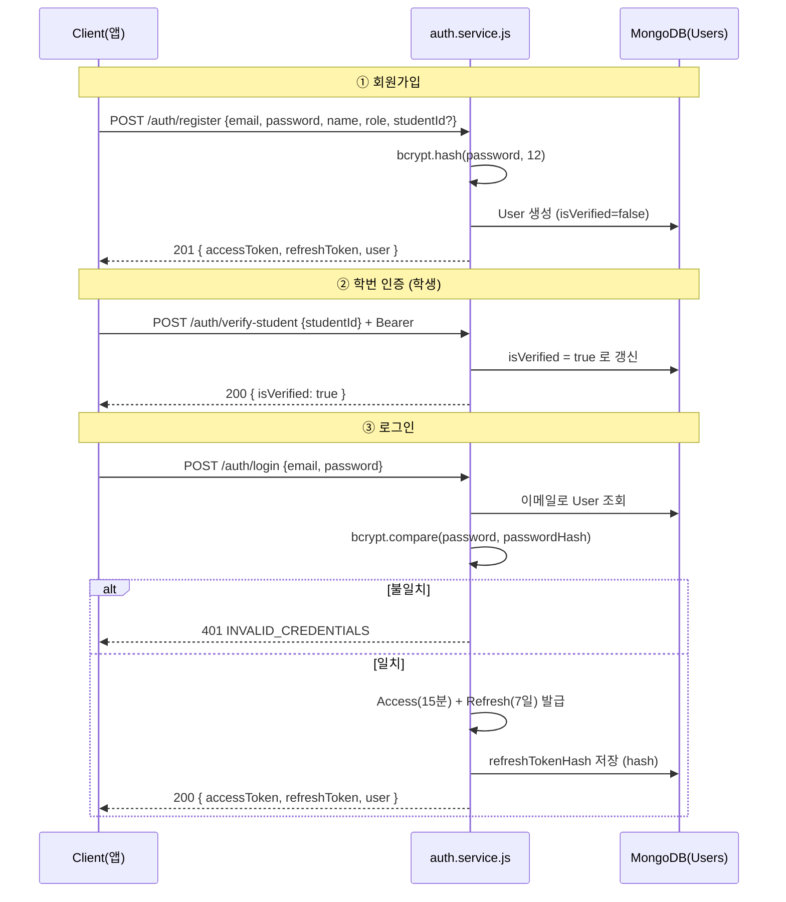
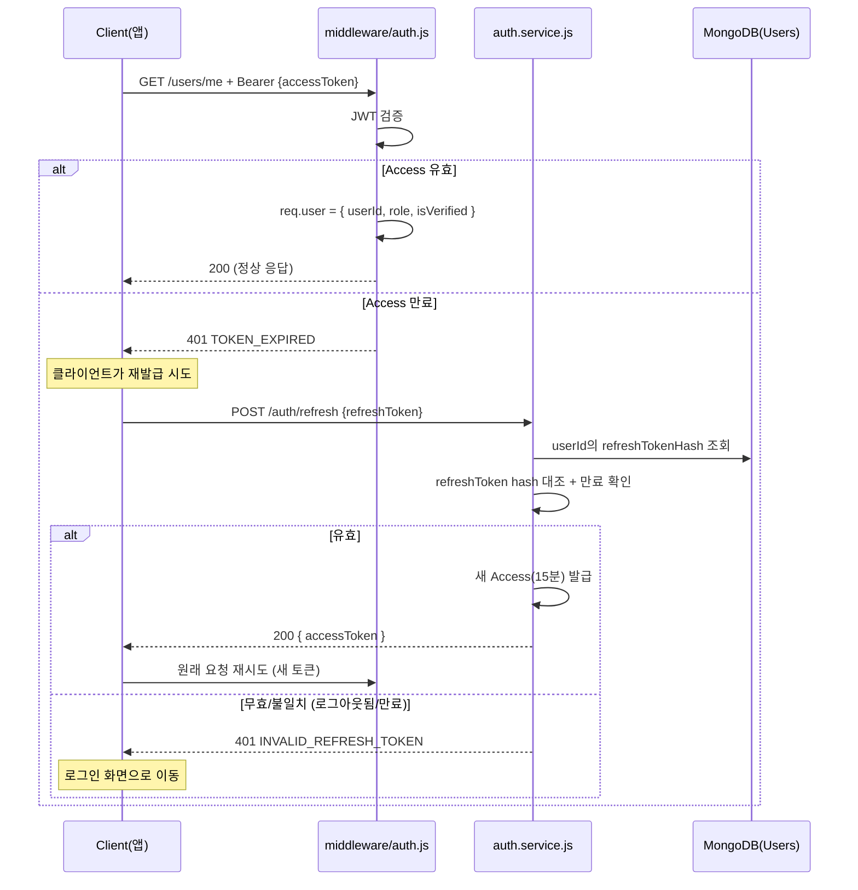
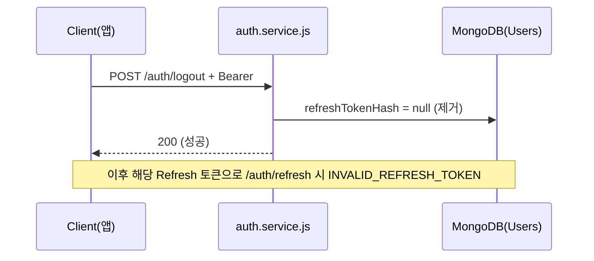

# 인증 플로우 (Authentication Flow)

> 세종페이 JWT 인증 흐름 정의. 담당: 유현석 (`auth.service.js`, `middleware/auth.js`).
> 구현 기준은 본 문서 + `api-contract.swagger.yaml`(8.1 Auth)이다.

## 토큰 정책 (확정)

| 항목 | 값 | 비고 |
|------|----|------|
| Access Token | **15분** | `Authorization: Bearer {accessToken}` 헤더로 전달 |
| Refresh Token | **7일** | 재발급 전용. DB에 **hash**로 저장 |
| 저장 위치 | `Users.refreshTokenHash` | 로그아웃 시 제거 → 즉시 무효화 |
| 비밀번호 | `bcrypt(saltRounds=12)` | `Users.passwordHash` |
| 미들웨어 주입 | `req.user` = 인증된 User 문서(민감필드 제외) — `userId`/`role`/`isVerified` 포함 | 실제 구현(`BE` auth 미들웨어)은 `User.findById().select('-passwordHash -refreshTokenHash')` 주입. 핸들러는 `req.user.userId` 등 사용 |

---

## 1. 회원가입 → 학번 인증 → 로그인



> **보안:** 로그인 실패 시 "이메일 없음"과 "비밀번호 틀림"을 구분하지 않고 모두
> `INVALID_CREDENTIALS`로 응답한다 (계정 존재 여부 노출 방지).

---

## 2. 보호된 API 호출 + Access 만료 → 재발급



---

## 3. 로그아웃 (Refresh 무효화)



---

## 4. RBAC (역할 기반 접근 제어) — `middleware/rbac.js`

`auth.js`가 주입한 `req.user.role`을 기준으로 접근 제어.

| role | 권한 범위 |
|------|----------|
| `student` | 결제·충전·리뷰·스탬프·쿠폰 사용 (인증 시 `isVerified=true` 필요) |
| `merchant` | 본인 가맹점 관리, 쿠폰 템플릿 발행, 매출 조회, 리뷰 답글 |
| `admin` | 가맹점 등록/삭제, 환불 처리 |

```js
// 사용 예 (라우트에서)
router.post('/merchants', authMiddleware, rbac('admin'), handler);
router.post('/transactions/payment', authMiddleware, requireVerified, handler);
```

권한 부족 시 → `403 FORBIDDEN`, 미인증 사용자 → `403 NOT_VERIFIED`.

---

## 설계 근거 (학습 메모)

- **왜 Refresh를 DB에 hash로 저장?**
  토큰 원문을 저장하면 DB 유출 시 그대로 악용 가능. hash만 저장하면 대조는 되지만 역산은 불가.
  또한 로그아웃 시 hash를 지우면 서버 측에서 Refresh를 즉시 무효화할 수 있다(JWT는 기본적으로 stateless라 무효화가 어려운데, 이 방식으로 해결).
- **왜 Access는 15분으로 짧게?**
  Access가 탈취돼도 피해 시간을 최소화. 대신 Refresh(7일)로 사용자 경험(잦은 재로그인) 보완.
- **왜 bcrypt saltRounds=12?**
  연산 비용을 높여 무차별 대입(brute-force)을 어렵게 함. 12는 보안과 응답속도의 일반적 균형점.

---

_문서 기준: R&SD PAYUS 웹 프로토타입 설계 v1.0 / 작성: 유현석_
